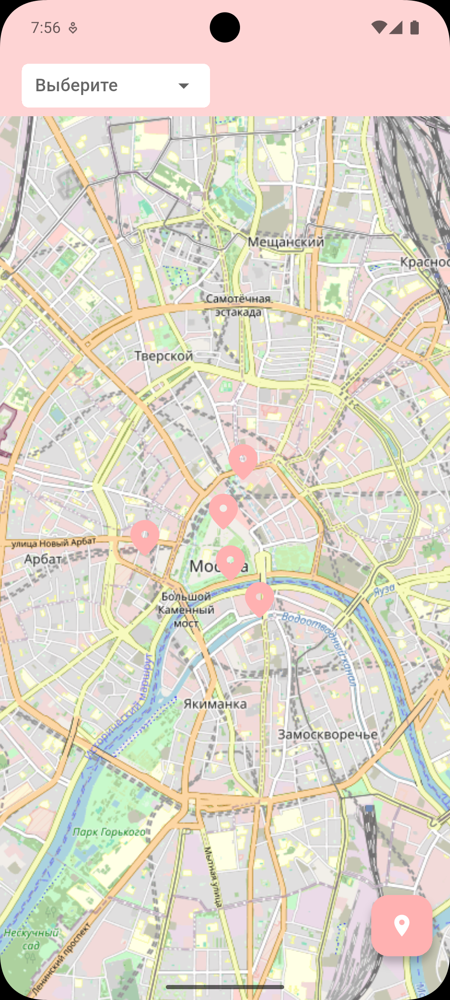
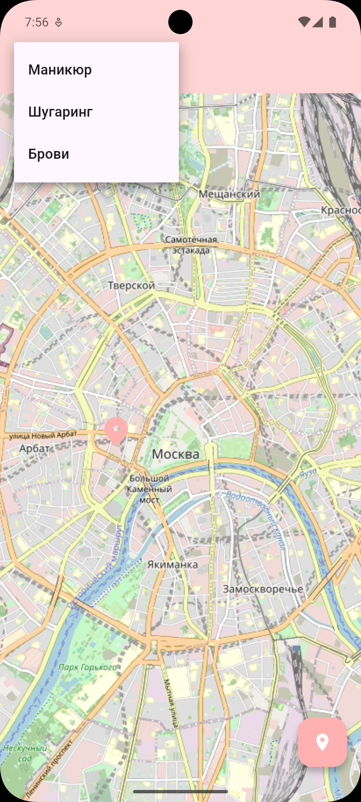

# Polka Test Task - Карта мастеров

Мобильное приложение для отображения мастеров красоты на карте с возможностью фильтрации по типу услуг.

## Описание проекта

Приложение демонстрирует базовую работу с:
- `flutter_map` для отображения карты
- Маркерами для показа местоположения мастеров
- Простыми фильтрами по типу услуг
- Локальными мок-данными
- Геолокацией пользователя

## Технические требования

- **Flutter**: ^3.8.1
- **Dart**: ^3.8.1
- **Android**: API 21+
- **iOS**: 11.0+

## Зависимости

### Основные пакеты
- `flutter_map: ^8.2.1` - карта на основе OpenStreetMap
- `latlong2: ^0.9.1` - работа с координатами
- `geolocator: ^14.0.2` - геолокация пользователя
- `flutter_bloc: ^9.1.1` - управление состоянием
- `freezed: ^3.2.0` - генерация кода для моделей
- `shared_preferences: ^2.5.3` - локальное хранение данных

## Структура проекта

```
lib/
├── blocs/           # BLoC для управления состоянием
├── core/            # Основные утилиты и цвета
├── data/            # Мок-данные мастеров
├── models/          # Модели данных
├── pages/           # Экраны приложения
├── repos/           # Репозитории для работы с данными
└── widgets/         # Переиспользуемые виджеты
```

## Модель данных

```dart
MasterModel {
  lat: double,           // Широта
  long: double,          // Долгота
  name: String,          // Имя мастера
  type: MasterType,      // Тип услуг
  description: String    // Описание
}

enum MasterType {
  manicure,    // Маникюр
  sugaring,    // Шугаринг
  eyebrows     // Брови
}
```

## Функциональность

### ✅ Реализовано (минимальные требования)

#### 1. Экран "Карта мастеров"
- [x] Получение данных из локального хранилища
- [x] Отображение маркеров на карте
- [x] Фильтрация по типу мастера
- [x] Переход на страницу мастера при нажатии на маркер

#### 2. Экран "Карточка мастера"
- [x] Фото мастера
- [x] Имя мастера
- [x] Краткое описание
- [x] Возможность вернуться на предыдущий экран

### 🎁 Бонусные функции

- [x] Кнопка "Моё местоположение"
  - Запрашивает разрешение на геолокацию
  - Центрирует карту на пользователе
  - Обработка ошибок с возможностью перехода в настройки

## Как запустить

### 1. Клонирование репозитория
```bash
git clone <repository-url>
cd polka_test_task
```

### 2. Установка зависимостей
```bash
flutter pub get
```

### 3. Генерация кода
```bash
flutter packages pub run build_runner build
```

### 4. Запуск приложения
```bash
flutter run
```

## Скриншоты

### Карта мастеров с маркерами


### Фильтрация по типу услуг


### Карточка мастера


## Автор

Разработано в рамках тестового задания для демонстрации навыков работы с Flutter.
